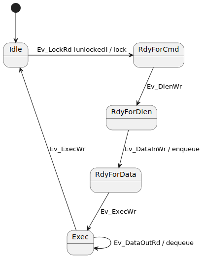

# Emulator for Caliptra 

This repository contains code for creating an emulator for the Caliptra hardware.

## Peripheral Emulation

### Mailbox 

#### Class Diagram

#### Mailbox State Machine
The UML state diagram depicted below represents the behavior of the mailbox state machine. The notation follows the UML conventions:

