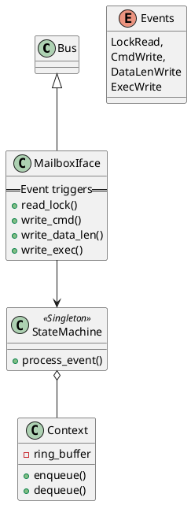

# Emulator for Caliptra 

This repository contains code for creating an emulator for the Caliptra hardware.

## Peripheral Emulation

### Mailbox 

#### Class Diagram


#### Mailbox State Machine
The UML state diagram depicted below represents the behavior of the mailbox state machine. The notation follows the UML conventions:

```
@startuml mb_state_diagram

[*] --> Idle

Idle -> RdyForCmd : Ev_LockRd [unlocked] / lock 
RdyForCmd --> RdyForDlen : Ev_DlenWr
RdyForDlen --> RdyForData : Ev_DataInWr / enqueue
RdyForData --> Exec : Ev_ExecWr
Exec --> Exec : Ev_DataOutRd / dequeue
Exec --> Idle : Ev_ExecWr

@enduml
```


Some more markdown.
